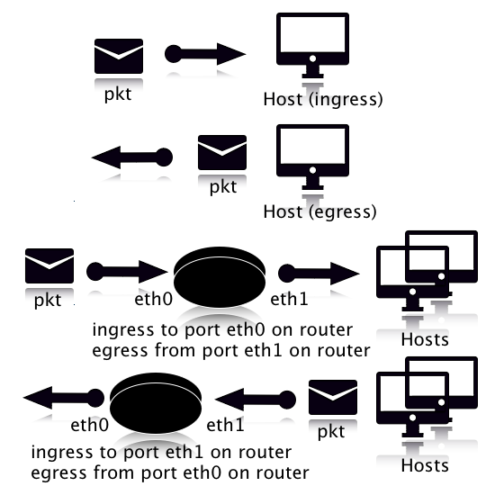

-------

# OpenC2 Actuator Profile for Stateless Packet Filtering Version 1.0
## Committee Specification 01
## 11 July 2019

#### This version:
https://docs.oasis-open.org/openc2/oc2slpf/v1.0/cs01/oc2slpf-v1.0-cs01.md (Authoritative) \
https://docs.oasis-open.org/openc2/oc2slpf/v1.0/cs01/oc2slpf-v1.0-cs01.html \
https://docs.oasis-open.org/openc2/oc2slpf/v1.0/cs01/oc2slpf-v1.0-cs01.pdf

#### Previous version:
https://docs.oasis-open.org/openc2/oc2slpf/v1.0/csprd02/oc2slpf-v1.0-csprd02.md (Authoritative) \
https://docs.oasis-open.org/openc2/oc2slpf/v1.0/csprd02/oc2slpf-v1.0-csprd02.html \
https://docs.oasis-open.org/openc2/oc2slpf/v1.0/csprd02/oc2slpf-v1.0-csprd02.pdf

#### Latest version:
https://docs.oasis-open.org/openc2/oc2slpf/v1.0/oc2slpf-v1.0.md (Authoritative) \
https://docs.oasis-open.org/openc2/oc2slpf/v1.0/oc2slpf-v1.0.html \
https://docs.oasis-open.org/openc2/oc2slpf/v1.0/oc2slpf-v1.0.pdf

#### Technical Committee:
[OASIS Open Command and Control (OpenC2) TC](https://www.oasis-open.org/committees/openc2/)

#### Chairs:
Joe Brule (jmbrule@nsa.gov), [National Security Agency](https://www.nsa.gov/) \
Duncan Sparrell (duncan@sfractal.com), [sFractal Consulting LLC](http://www.sfractal.com/)

#### Editors:
Joe Brule (jmbrule@nsa.gov), [National Security Agency](https://www.nsa.gov/) \
Duncan Sparrell (duncan@sfractal.com), [sFractal Consulting](http://www.sfractal.com/) \
Alex Everett (alex.everett@unc.edu), [University of North Carolina, Chapel Hill](http://www.unc.edu/)

#### Abstract:

Open Command and Control (OpenC2) is a concise and extensible language to enable the command and control of cyber defense components, subsystems and/or systems in a manner that is agnostic of the underlying products, technologies, transport mechanisms or other aspects of the implementation. Stateless packet filtering is a cyber defense mechanism that denies or allows traffic based on static properties of the traffic, such as address, port, protocol, etc. This profile defines the Actions, Targets, Specifiers and Options that are consistent with the version 1.0 of the OpenC2 Language Specification ([[OpenC2-Lang-v1.0]](#openc2-lang-v10)) in the context of stateless packet filtering (SLPF).

#### Status:
This document was last revised or approved by the OASIS Open Command and Control (OpenC2) TC on the above date. The level of approval is also listed above. Check the "Latest version" location noted above for possible later revisions of this document. Any other numbered Versions and other technical work produced by the Technical Committee (TC) are listed at https://www.oasis-open.org/committees/tc_home.php?wg_abbrev=openc2#technical.

TC members should send comments on this specification to the TC's email list. Others should send comments to the TC's public comment list, after subscribing to it by following the instructions at the "Send A Comment" button on the TC's web page at https://www.oasis-open.org/committees/openc2/.

This specification is provided under the [Non-Assertion](https://www.oasis-open.org/policies-guidelines/ipr#Non-Assertion-Mode) Mode of the OASIS IPR Policy, the mode chosen when the Technical Committee was established. For information on whether any patents have been disclosed that may be essential to implementing this specification, and any offers of patent licensing terms, please refer to the Intellectual Property Rights section of the TC's web page (https://www.oasis-open.org/committees/openc2/ipr.php).

Note that any machine-readable content ([Computer Language Definitions](https://www.oasis-open.org/policies-guidelines/tc-process#wpComponentsCompLang)) declared Normative for this Work Product is provided in separate plain text files. In the event of a discrepancy between any such plain text file and display content in the Work Product's prose narrative document(s), the content in the separate plain text file prevails.

#### Citation format:
When referencing this specification the following citation format should be used:

**[OpenC2-SLPF-v1.0]**
_Open Command and Control (OpenC2) Profile for Stateless Packet Filtering Version 1.0_. Edited by Joe Brule, Duncan Sparrell and Alex Everett. 11 July 2019. Committee Specification 01. https://docs.oasis-open.org/openc2/oc2slpf/v1.0/cs01/oc2slpf-v1.0-cs01.html. Latest version: https://docs.oasis-open.org/openc2/oc2slpf/v1.0/oc2slpf-v1.0.html.

-------

## Notices
Copyright © OASIS Open 2019. All Rights Reserved.

All capitalized terms in the following text have the meanings assigned to them in the OASIS Intellectual Property Rights Policy (the "OASIS IPR Policy"). The full [Policy](https://www.oasis-open.org/policies-guidelines/ipr) may be found at the OASIS website.

This document and translations of it may be copied and furnished to others, and derivative works that comment on or otherwise explain it or assist in its implementation may be prepared, copied, published, and distributed, in whole or in part, without restriction of any kind, provided that the above copyright notice and this section are included on all such copies and derivative works. However, this document itself may not be modified in any way, including by removing the copyright notice or references to OASIS, except as needed for the purpose of developing any document or deliverable produced by an OASIS Technical Committee (in which case the rules applicable to copyrights, as set forth in the OASIS IPR Policy, must be followed) or as required to translate it into languages other than English.

The limited permissions granted above are perpetual and will not be revoked by OASIS or its successors or assigns.

This document and the information contained herein is provided on an "AS IS" basis and OASIS DISCLAIMS ALL WARRANTIES, EXPRESS OR IMPLIED, INCLUDING BUT NOT LIMITED TO ANY WARRANTY THAT THE USE OF THE INFORMATION HEREIN WILL NOT INFRINGE ANY OWNERSHIP RIGHTS OR ANY IMPLIED WARRANTIES OF MERCHANTABILITY OR FITNESS FOR A PARTICULAR PURPOSE.

OASIS requests that any OASIS Party or any other party that believes it has patent claims that would necessarily be infringed by implementations of this OASIS Committee Specification or OASIS Standard, to notify OASIS TC Administrator and provide an indication of its willingness to grant patent licenses to such patent claims in a manner consistent with the IPR Mode of the OASIS Technical Committee that produced this specification.

OASIS invites any party to contact the OASIS TC Administrator if it is aware of a claim of ownership of any patent claims that would necessarily be infringed by implementations of this specification by a patent holder that is not willing to provide a license to such patent claims in a manner consistent with the IPR Mode of the OASIS Technical Committee that produced this specification. OASIS may include such claims on its website, but disclaims any obligation to do so.

OASIS takes no position regarding the validity or scope of any intellectual property or other rights that might be claimed to pertain to the implementation or use of the technology described in this document or the extent to which any license under such rights might or might not be available; neither does it represent that it has made any effort to identify any such rights. Information on OASIS' procedures with respect to rights in any document or deliverable produced by an OASIS Technical Committee can be found on the OASIS website. Copies of claims of rights made available for publication and any assurances of licenses to be made available, or the result of an attempt made to obtain a general license or permission for the use of such proprietary rights by implementers or users of this OASIS Committee Specification or OASIS Standard, can be obtained from the OASIS TC Administrator. OASIS makes no representation that any information or list of intellectual property rights will at any time be complete, or that any claims in such list are, in fact, Essential Claims.

The name "OASIS" is a trademark of [OASIS](https://www.oasis-open.org/), the owner and developer of this specification, and should be used only to refer to the organization and its official outputs. OASIS welcomes reference to, and implementation and use of, specifications, while reserving the right to enforce its marks against misleading uses. Please see https://www.oasis-open.org/policies-guidelines/trademark for above guidance.

-------

# Table of Contents
-   [1 Introduction](#1-introduction)
    -   [1.1 IPR Policy](#11-ipr-policy)
    -   [1.2 Terminology](#12-terminology)
    -   [1.3 Normative References](#13-normative-references)
    -   [1.4 Non-Normative References](#14-non-normative-references)
    -   [1.5 Document Conventions](#15-document-conventions)
        -   [1.5.1 Naming Conventions](#151-naming-conventions)
        -   [1.5.2 Font Colors and Style](#152-font-colors-and-style)
    -   [1.6 Overview](#16-overview)
    -   [1.7 Goal](#17-goal)
    -   [1.8 Purpose and Scope](#18-purpose-and-scope)
-   [2 OpenC2 Language Binding](#2-openc2-language-binding)
    -   [2.1 OpenC2 Command Components](#21-openc2-command-components)
        -   [2.1.1 Actions](#211-actions)
        -   [2.1.2 Targets](#212-targets)
        -   [2.1.3 Command Arguments](#213-command-arguments)
        -   [2.1.4 Actuator Specifiers](#214-actuator-specifiers)
    -   [2.2 OpenC2 Response Components](#22-openc2-response-components)
        -   [2.2.1 Common Results](#221-common-results)
        -   [2.2.2 SLPF Results](#222-slpf-results)
        -   [2.2.3 Response Status Codes](#223-response-status-codes)
    -   [2.3 OpenC2 Commands](#23-openc2-commands)
        -   [2.3.1 Allow](#231-allow)
        -   [2.3.2 Deny](#232-deny)
        -   [2.3.3 Query](#233-query)
        -   [2.3.4 Delete](#234-delete)
        -   [2.3.5 Update](#235-update)
-   [3 Conformance statements](#3-conformance-statements)
    -   [3.1 Clauses Pertaining to the OpenC2 Producer Conformance
        Target](#31-clauses-pertaining-to-the-openc2-producer-conformance-target)
        -   [3.1.1 Conformance Clause 1: Baseline OpenC2
            Producer](#311-conformance-clause-1-baseline-openc2-producer)
        -   [3.1.2 Conformance Clause 2: IP Version 4 Connection
            Producer](#312-conformance-clause-2-ip-version-4-connection-producer)
        -   [3.1.3 Conformance Clause 3: IP Version 6 Connection
            Producer](#313-conformance-clause-3-ip-version-6-connection-producer)
        -   [3.1.4 Conformance Clause 4: IP Version 4 Net
            Producer](#314-conformance-clause-4-ip-version-4-net-producer)
        -   [3.1.5 Conformance Clause 5: IP Version 6 Net
            Producer](#315-conformance-clause-5-ip-version-6-net-producer)
        -   [3.1.6 Conformance Clause 6: Update File
            Producer](#316-conformance-clause-6-update-file-producer)
        -   [3.1.7 Conformance Clause 7: delete rule number
            Producer](#317-conformance-clause-7-delete-rule-number-producer)
        -   [3.1.8 Conformance Clause 8: Persistent
            Producer](#318-conformance-clause-8-persistent-producer)
        -   [3.1.9 Conformance Clause 9: Direction
            Producer](#319-conformance-clause-9-direction-producer)
        -   [3.1.10 Conformance Clause 10: drop-process
            Producer](#3110-conformance-clause-10-drop-process-producer)
        -   [3.1.11 Conformance Clause 11: Temporal
            Producer](#3111-conformance-clause-11-temporal-producer)
    -   [3.2 Clauses Pertaining to the OpenC2 Consumer Conformance
        Target](#32-clauses-pertaining-to-the-openc2-consumer-conformance-target)
        -   [3.2.1 Conformance Clause 12: Baseline OpenC2
            Consumer](#321-conformance-clause-12-baseline-openc2-consumer)
        -   [3.2.2 Conformance Clause 13: IP Version 4 Connection
            Consumer](#322-conformance-clause-13-ip-version-4-connection-consumer)
        -   [3.2.3 Conformance Clause 14: IP Version 6 Connection
            Consumer](#323-conformance-clause-14-ip-version-6-connection-consumer)
        -   [3.2.4 Conformance Clause 15: IP Version 4 Net
            Consumer](#324-conformance-clause-15-ip-version-4-net-consumer)
        -   [3.2.5 Conformance Clause 16: IP Version 6 Net
            Consumer](#325-conformance-clause-16-ip-version-6-net-consumer)
        -   [3.2.6 Conformance Clause 17: Update File
            Consumer](#326-conformance-clause-17-update-file-consumer)
        -   [3.2.7 Conformance Clause 18: delete rule number
            Consumer](#327-conformance-clause-18-delete-rule-number-consumer)
        -   [3.2.8 Conformance Clause 19: Persistent
            Consumer](#328-conformance-clause-19-persistent-consumer)
        -   [3.2.9 Conformance Clause 20: Direction
            Consumer](#329-conformance-clause-20-direction-consumer)
        -   [3.2.10 Conformance Clause 21: drop-process
            Consumer](#3210-conformance-clause-21-drop-process-consumer)
        -   [3.2.11 Conformance Clause 22: Temporal
            Consumer](#3211-conformance-clause-22-temporal-consumer)
-   [Annex A: Sample Commands](#annex-a-sample-commands)
    -   [A.1 Deny and Allow](#a1-deny-and-allow)
        -   [A.1.1 Deny a particular
            connection](#a11-deny-a-particular-connection)
        -   [A.1.2 Deny all outbound ftp
            transfers](#a12-deny-all-outbound-ftp-transfers)
        -   [A.1.3 Block all inbound traffic from a particular
            source.](#a13-block-all-inbound-traffic-from-a-particular-source)
        -   [A.1.4 Permit ftp transfers to a particular
            destination.](#a14-permit-ftp-transfers-to-a-particular-destination)
    -   [A.2 Delete Rule](#a2-delete-rule)
    -   [A.3 Update file](#a3-update-file)
    -   [A.4 Query features](#a4-query-features)
        -   [A.4.1 No query items set](#a41-no-query-items-set)
        -   [A.4.2 Version of Language specification
            supported](#a42-version-of-language-specification-supported)
        -   [A.4.3 Actuator profiles
            supported](#a43-actuator-profiles-supported)
        -   [A.4.4 Specific Commands
            Supported](#a44-specific-commands-supported)
-   [Annex B: Acronyms](#annex-b-acronyms)
-   [Annex C: Acknowledgments](#annex-c-acknowledgments)
-   [Annex D: Revision History](#annex-d-revision-history)

-------

# 1 Introduction

_The content in this section is non-normative, except where it is marked normative._

OpenC2 is a suite of specifications that enables command and control of cyber defense systems and components. OpenC2 typically uses a request-response paradigm where a _Command_ is encoded by a _Producer_ (managing application) and transferred to a _Consumer_ (managed device or virtualized function) using a secure transfer protocol, and the Consumer can respond with status and any requested information.

OpenC2 allows the application producing the commands to discover the set of capabilities supported by the managed devices. These capabilities permit the managing application to adjust its behavior to take advantage of the features exposed by the managed device. The capability definitions can be easily extended in a noncentralized manner, allowing standard and non-standard capabilities to be defined with semantic and syntactic rigor.

## 1.1 IPR Policy
This specification is provided under the [Non-Assertion](https://www.oasis-open.org/policies-guidelines/ipr#Non-Assertion-Mode) Mode of the [OASIS IPR Policy](https://www.oasis-open.org/policies-guidelines/ipr), the mode chosen when the Technical Committee was established. For information on whether any patents have been disclosed that may be essential to implementing this specification, and any offers of patent licensing terms, please refer to the Intellectual Property Rights section of the TC's web page ([https://www.oasis-open.org/committees/openc2/ipr.php](https://www.oasis-open.org/committees/openc2/ipr.php)).

## 1.2 Terminology

_This section is normative._

* **Action**: The task or activity to be performed (e.g., 'deny').
* **Actuator**: The function performed by the Consumer that executes the Command (e.g., 'Stateless Packet Filtering').
* **Argument**: A property of a Command that provides additional information on how to perform the Command, such as date/time, periodicity, duration, etc.
* **Command**: A Message defined by an Action-Target pair that is sent from a Producer and received by a Consumer.
* **Consumer**: A managed device / application that receives Commands. Note that a single device / application can have both Consumer and Producer capabilities.
* **Message**: A content- and transport-independent set of elements conveyed between Consumers and Producers.
* **Producer**: A manager application that sends Commands.
* **Response**: A Message from a Consumer to a Producer acknowledging a Command or returning the requested resources or status to a previously received Command.
* **Specifier**: A property or field that identifies a Target or Actuator to some level of precision.
* **Target**: The object of the Action, i.e., the Action is performed on the Target (e.g., IP Address).

The key words "MUST", "MUST NOT", "REQUIRED", "SHALL", "SHALL NOT", "SHOULD", "SHOULD NOT", "RECOMMENDED", "NOT RECOMMENDED", "MAY", and "OPTIONAL" in this document are to be interpreted as described in [[RFC2119]](#rfc2119) and [[RFC8174]](#rfc8174) when, and only when, they appear in all capitals, as shown here.

## 1.3 Normative References

###### [RFC1034]
Mockapetris, P., "Domain names - concepts and facilities", STD 13, RFC 1034, DOI 10.17487/RFC1034, November 1987, <https://www.rfc-editor.org/info/rfc1034>.
###### [RFC1123]
Braden, R., Ed., "Requirements for Internet Hosts - Application and Support", STD 3, RFC 1123, DOI 10.17487/RFC1123, October 1989, <https://www.rfc-editor.org/info/rfc1123>.
###### [RFC2119]
Bradner, S., "Key words for use in RFCs to Indicate Requirement Levels", BCP 14, RFC 2119, DOI 10.17487/RFC2119, March 1997, <https://www.rfc-editor.org/info/rfc2119>.
###### [RFC2780]
Bradner, S. and V. Paxson, "IANA Allocation Guidelines For Values In the Internet Protocol and Related Headers", BCP 37, RFC 2780, DOI 10.17487/RFC2780, March 2000, <https://www.rfc-editor.org/info/rfc2780>.
###### [RFC4443]
Conta, A., Deering, S., and M. Gupta, Ed., "Internet Control Message Protocol (ICMPv6) for the Internet Protocol Version 6 (IPv6) Specification", STD 89, RFC 4443, DOI 10.17487/RFC4443, March 2006, <https://www.rfc-editor.org/info/rfc4443>.
###### [RFC8174]
Leiba, B., "Ambiguity of Uppercase vs Lowercase in RFC 2119 Key Words", BCP 14, RFC 8174, DOI 10.17487/RFC8174, May 2017, <https://www.rfc-editor.org/info/rfc8174>.
###### [RFC8259]
Bray, T., Ed., "The JavaScript Object Notation (JSON) Data Interchange Format", STD 90, RFC 8259, DOI 10.17487/RFC8259, December 2017, <https://www.rfc-editor.org/info/rfc8259>.
###### [OpenC2-Lang-v1.0]
_Open Command and Control (OpenC2) Language Specification Version 1.0_. Edited by Jason Romano and Duncan Sparrell. November 2018, <http://docs.oasis-open.org/openc2/oc2ls/v1.0/oc2ls-v1.0.html>.

## 1.4 Non-Normative References

###### [RFC3339]
Klyne, G. and C. Newman, "Date and Time on the Internet: Timestamps", RFC 3339, DOI 10.17487/RFC3339, July 2002, <https://www.rfc-editor.org/info/rfc3339>.
###### [RFC4291]
Hinden, R. and S. Deering, "IP Version 6 Addressing Architecture", RFC 4291, DOI 10.17487/RFC4291, February 2006, <https://www.rfc-editor.org/info/rfc4291>.
###### [RFC6891]
Damas, J., Graff, M., and P. Vixie, "Extension Mechanisms for DNS (EDNS(0))", STD 75, RFC 6891, DOI 10.17487/RFC6891, April 2013, <https://www.rfc-editor.org/info/rfc6891>..
###### [RFC5237]
Arkko, J. and S. Bradner, "IANA Allocation Guidelines for the Protocol Field", BCP 37, RFC 5237, DOI 10.17487/RFC5237, February 2008, <https://www.rfc-editor.org/info/rfc5237>.
###### [OpenC2-HTTPS-v1.0]
Specification for Transfer of OpenC2 Messages via HTTPS Version 1.0. Edited by David Lemire. November, 2018, <http://docs.oasis-open.org/openc2/open-impl-https/v1.0/open-impl-https-v1.0.html>.
###### [ACD]
Herring, M.J. and Willett, K.D. "Active Cyber Defense: A Vision for Real-Time Cyber Defense," Journal of Information Warfare, vol. 13, Issue 2, p. 80, April 2014, <https://www.semanticscholar.org/paper/Active-Cyber-Defense-%3A-A-Vision-for-Real-Time-Cyber-Herring-Willett/7c128468ae42584f282578b86439dbe9e8c904a8>.
###### [IACD]
Willett, Keith D., "Integrated Adaptive Cyberspace Defense: Secure Orchestration", International Command and Control Research and Technology Symposium, June 2015 <https://www.semanticscholar.org/paper/Integrated-Adaptive-Cyberspace-Defense-%3A-Secure-by-Willett/a22881b8a046e7eab11acf647d530c2a3b03b762>.

## 1.5 Document Conventions
### 1.5.1 Naming Conventions
* [[RFC2119]](#rfc2119)/[[RFC8174]](#rfc8174) key words (see [Section 1.2](#12-terminology)) are in all uppercase.
* All property names and literals are in lowercase, except when referencing canonical names defined in another standard (e.g., literal values from an IANA registry).
* Words in property names are separated with an underscore (_), while words in string enumerations and type names are separated with a hyphen (-).
* The term "hyphen" used here refers to the ASCII hyphen or minus character, which in Unicode is "hyphen-minus", U+002D.

### 1.5.2 Font Colors and Style
The following color, font and font style conventions are used in this document:

* A fixed width font is used for all type names, property names, and literals.
* Property names are in bold style – **'created_at'**.
* All examples in this document are expressed in JSON. They are in fixed width font, with straight quotes, black text and a light shaded background, and 4-space indentation. JSON examples in this document are representations of JSON Objects. They should not be interpreted as string literals. The ordering of object keys is insignificant. Whitespace before or after JSON structural characters in the examples are insignificant [[RFC8259]](#rfc8259).
* Parts of the example may be omitted for conciseness and clarity. These omitted parts are denoted with ellipses (...).

Example:

```json
{
    "action": "deny",
    "target": {
        "file": {
            "hashes": {
                "sha256": "22fe72a34f006ea67d26bb7004e2b6941b5c3953d43ae7ec24d41b1a928a6973"
            }
        }
    }
}
```

## 1.6 Overview
In general, there are two types of participants involved in the exchange of OpenC2 Messages, as depicted in Figure 1-1:
1. **Producers**: A Producer is an entity that creates Commands to provide instruction to one or more systems to act in accordance with the content of the Command. A Producer may receive and process Responses in conjunction with a Command.
2. **Consumers**: A Consumer is an entity that receives and may act upon a Command. A Consumer may create Responses that provide any information captured or necessary to send back to the Producer.


**Figure 1-1. OpenC2 Message Exchange**

OpenC2 is a suite of specifications for Producers and Consumers to command and execute cyber defense functions. These specifications include the OpenC2 Language Specification, Actuator Profiles, and Transfer Specifications. The OpenC2 Language Specification and Actuator Profile specifications focus on the language content and meaning at the Producer and Consumer of the Command and Response while the transfer specifications focus on the protocols for their exchange.
* The **OpenC2 Language Specification ([[OpenC2-Lang-v1.0]](#openc2-lang-v10))** provides the semantics for the essential elements of the language, the structure for Commands and Responses, and the schema that defines the proper syntax for the language elements that represents the Command or Response.
* **OpenC2 Actuator Profiles** specify the subset of the OpenC2 language relevant in the context of specific Actuator functions. Cyber defense components, devices, systems and/or instances may (in fact are likely to) implement multiple Actuator profiles. Actuator profiles extend the language by defining Specifiers that identify the Actuator to the required level of precision. Actuator Profiles may define Command Arguments and Targets that are relevant and/or unique to those Actuator functions.
* **OpenC2 Transfer Specifications** utilize existing protocols and standards to implement OpenC2 in specific environments. These standards are used for communications and security functions beyond the scope of the language, such as message transfer encoding, authentication, and end-to-end transport of OpenC2 Messages.

The OpenC2 Language Specification defines a language used to compose Messages for command and control of cyber defense systems and components. A Message consists of a header and a payload (_defined_ as a Message body in the OpenC2 Language Specification Version 1.0 and _specified_ in one or more Actuator profiles).

The language defines two payload structures:

1. **Command**: An instruction from one system known as the Producer, to one or more systems, the Consumer(s), to act on the content of the Command.
2. **Response**: Any information sent back to the Producer as a result of the Command.

OpenC2 implementations integrate the related OpenC2 specifications described above with related industry specifications, protocols, and standards. Figure 1-2 depicts the relationships among OpenC2 specifications, and their relationships to other industry standards and environment-specific implementations of OpenC2. Note that the layering of implementation aspects in the diagram is notional, and not intended to preclude any particular approach to implementing the needed functionality (for example, the use of an application-layer message signature function to provide message source authentication and integrity).


**Figure 1-2. OpenC2 Documentation and Layering Model**

OpenC2 is conceptually partitioned into four layers as shown in Table 1-1.

**Table 1-1. OpenC2 Protocol Layers**

| Layer | Examples |
| :--- | :--- |
| Function-Specific Content | Actuator Profiles<br>(standard and extensions) |
| Common Content | Language Specification<br>[[OpenC2-Lang-v1.0]](#openc2-lang-v10) |
| Message | Transfer Specifications<br>([[OpenC2-HTTPS-v1.0]](#openc2-https-v10), OpenC2-over-CoAP, ...) |
| Secure Transport | HTTPS, CoAP, MQTT, OpenDXL, ... |

* The **Secure Transport** layer provides a communication path between the Producer and the Consumer. OpenC2 can be layered over any standard transport protocol.
* The **Message** layer provides a transfer- and content-independent mechanism for conveying Messages. A transfer specification maps transfer-specific protocol elements to a transfer-independent set of message elements consisting of content and associated metadata.
* The **Common Content** layer defines the structure of Commands and Responses and a set of common language elements used to construct them.
* The **Function-specific Content** layer defines the language elements used to support a particular cyber defense function. An Actuator profile defines the implementation conformance requirements for that function. Producers and Consumers will support one or more profiles.

The components of a Command are an Action (what is to be done), a Target (what is being acted upon), an optional Actuator (what is performing the command), and Command Arguments, which influence how the Command is to be performed. An Action coupled with a Target is sufficient to describe a complete Command. Though optional, the inclusion of an Actuator and/or Command Arguments provides additional precision to a Command.

The components of a Response are a numerical status code, an optional status text string, and optional results. The format of the results, if included, depend on the type of Response being transferred.

## 1.7 Goal
The goal of the OpenC2 Language Specification is to provide a language for interoperating between functional elements of cyber defense systems. This language used in conjunction with OpenC2 Actuator Profiles and OpenC2 Transfer Specifications allows for vendor-agnostic cybertime response to attacks.

The Integrated Adaptive Cyber Defense (IACD) framework defines a collection of activities, based on the traditional OODA (Observe–Orient–Decide–Act) Loop [[IACD]](#iacd):

* Sensing:  gathering of data regarding system activities
* Sense Making:  evaluating data using analytics to understand what's happening
* Decision Making:  determining a course-of-action to respond to system events
* Acting:  Executing the course-of-action

The goal of OpenC2 is to enable coordinated defense in cyber-relevant time between decoupled blocks that perform cyber defense functions. OpenC2 focuses on the Acting portion of the IACD framework; the assumption that underlies the design of OpenC2 is that the sensing/analytics have been provisioned and the decision to act has been made. This goal and these assumptions guide the design of OpenC2:

* **Technology Agnostic:**  The OpenC2 language defines a set of abstract atomic cyber defense actions in a platform and implementation agnostic manner
* **Concise:**  A Command is intended to convey only the essential information required to describe the action required and can be represented in a very compact form for communications-constrained environments
* **Abstract:**  Commands and Responses are defined abstractly and can be encoded and transferred via multiple schemes as dictated by the needs of different implementation environments
* **Extensible:**  While OpenC2 defines a core set of Actions and Targets for cyber defense, the language is expected to evolve with cyber defense technologies, and permits extensions to accommodate new cyber defense technologies.

## 1.8 Purpose and Scope
A 'Stateless Packet Filter' (SLPF) is a policy enforcement mechanism that restricts or permits traffic based on static values such as source address, destination address, and/or port numbers. A Stateless Packet Filter does not consider traffic patterns, connection state, data flows, applications, or payload information. The scope of this profile is limited to Stateless Packet Filtering herein referred to as SLPF.

This Actuator profile specifies the set of Actions, Targets, Specifiers, and Command Arguments that integrates SLPF functionality with the Open Command and Control (OpenC2) Command set. Through this Command set, cyber security orchestrators may gain visibility into and provide control over the SLPF functionality in a manner that is independent of the instance of the SLPF function.

All components, devices and systems that provide SLPF functionality will implement the OpenC2 Actions, Targets, Specifiers and Arguments identified as required in this document. Actions that are applicable, but not necessarily required, for SLPF will be identified as optional.

The purpose of this document is to:

* Identify the required and optional OpenC2 Actions for Actuators with SLPF functionality
* Identify the required and optional Target types for each Action in the SLPF class of Actuators
* Identify Actuator-Specifiers and Arguments for each Action/Target pair that are applicable and/or unique to the SLPF class of Actuators
* Annotate each Action/Target pair with a justification and example, and provide sample OpenC2 Commands to a SLPF with corresponding Responses

This SLPF profile:

* Does not define or implement Actions beyond those defined in Version 1.0 of the [[OpenC2-Lang-v1.0]](#openc2-lang-v10)
* Is consistent with Version 1.0 of the OpenC2 Language Specification

Cyber defense systems that are utilizing OpenC2 may require the following components to implement the SLPF profile:

* OpenC2 Producers: Devices that send Commands, receive Responses, and manage the execution of Commands involving one or more SLPF or other Actuators with SLPF capability. The OpenC2 Producer needs _a priori_ knowledge of which Commands the Actuator can process and execute, therefore must understand the profiles for any device that it intends to command
* OpenC2 Consumers: Devices or instances that provide stateless packet filtering functions. Typically these are Actuators that execute the cyber defense function, but could be orchestrators (i.e., a device or instance that forwards Commands to the Actuator)

Though cyber defense components, devices, systems and/or instances may implement multiple Actuator profiles, a particular OpenC2 Message may reference at most a single Actuator profile. The scope of this document is limited to SLPF.

This specification is organized into three major sections.

Section One (this section) provides a non-normative overview of the suite of specifications that realize OpenC2. This section provides references as well as defines the scope and purpose of this specification.

[Section Two](#2-openc2-language-binding) (normative) binds this particular profile to the OpenC2 Language Specification. Section Two enumerates the components of the language specification that are meaningful in the context of SLPF and defines components that are applicable to this distinct profile. Section Two also defines the Commands (i.e., the Action/Target pairs) that are permitted in the context of SLPF.

[Section Three](#3-conformance-statements) (normative) presents definitive criteria for conformance so that cyber security stakeholders can be assured that their products, instances and/or integrations are compatible with OpenC2.

[Annex A](#annex-a-sample-commands) (non-normative) provides multiple examples of Commands and associated Responses (JSON serialization) to facilitate development.

---

# 2 OpenC2 Language Binding

_This section is normative_

This section defines the set of Actions, Targets, Specifiers, and Arguments that are meaningful in the context of an SLPF. This section also describes the appropriate format for the status and properties of a Response frame. This section is organized into three major subsections; Command Components, Response Components and Commands.

Extensions to the Language Specification are defined in accordance with [[OpenC2-Lang-v1.0]](#openc2-lang-v10), Section 3.1.5, where:

1. The unique name of the SLPF schema is `oasis-open.org/openc2/v1.0/ap-slpf`
2. The namespace identifier (nsid) referring to the SLPF schema is:  `slpf`
3. The definitions of and conformance requirements for these types are contained in this document

## 2.1 OpenC2 Command Components
The components of an OpenC2 Command include Actions, Targets, Actuators and associated Arguments and Specifiers. Appropriate aggregation of the components will define a Command-body that is meaningful in the context of an SLPF.

This specification identifies the applicable components of an OpenC2 Command. The components of an OpenC2 Command include:

* Action:  A subset of the Actions defined in the OpenC2 Language Specification that are meaningful in the context of a SLPF.
    * This profile SHALL NOT define Actions that are external to Version 1.0 of the [OpenC2 Language Specification](#openc2-lang-v10)
    * This profile MAY augment the definition of the Actions in the context of a SLPF
    * This profile SHALL NOT define Actions in a manner that is inconsistent with version 1.0 of the OpenC2 Language Specification
* Target:  A subset of the Targets and Target-Specifiers defined in Version 1.0 of the OpenC2 Language Specification that are meaningful in the context of SLPF and one Target (and its associated Specifier) that is defined in this specification
* Arguments:  A subset of the Arguments defined in the Language Specification and a set of Arguments defined in this specification
* Actuator:  A set of specifiers defined in this specification that are meaningful in the context of SLPF

### 2.1.1 Actions
Table 2.1.1-1 presents the OpenC2 Actions defined in version 1.0 of the Language Specification which are meaningful in the context of an SLPF. The particular Action/Target pairs that are required or are optional are presented in [Section 2.3](#23-openc2-commands).

**Table 2.1.1-1. Actions Applicable to SLPF**

**_Type: Action (Enumerated)_**

| ID | Name | Description |
| :--- | :--- | :--- |
| 3 | **query** | Initiate a request for information. Used to communicate the supported options and determine the state or settings |
| 6 | **deny** | Prevent traffic or access |
| 8 | **allow** | Permit traffic or access |
| 16 | **update** | Instructs the Actuator to update its configuration by retrieving and processing a configuration file and update |
| 20 | **delete** | Remove an access rule |

### 2.1.2 Targets
Table 2.1.2-1 summarizes the Targets defined in Version 1.0 of the [[OpenC2-Lang-v1.0]](#openc2-lang-v10) as they relate to SLPF functionality. Table 2.1.2-2 summarizes the Targets that are defined in this specification.

#### 2.1.2.1 Common Targets
Table 2.1.2-1 lists the Targets defined in the OpenC2 Language Specification that are applicable to SLPF. The particular Action/Target pairs that are required or are optional are presented in [Section 2.3](#23-openc2-commands).

**Table 2.1.2-1. Targets Applicable to SLPF**

**_Type: Target (Choice)_**

| ID | Name | Type | Description |
| :--- | :--- | :--- | :--- |
| 9 | **features** | Features | A set of items such as Action/Target pairs, profiles versions, options that are supported by the Actuator. The Target is used with the query Action to determine an Actuator's capabilities |
| 10 | **file** | File | Properties of a file |
| 13 | **ipv4_net** | IPv4-Net | The representation of one or more IPv4 addresses expressed using CIDR notation |
| 14 | **ipv6_net** | IPv6-Net | The representation of one or more IPv6 addresses expressed using CIDR notation |
| 15 | **ipv4_connection** | IPv4-Connection | A network connection as specified by a five-tuple (IPv4) |
| 16 | **ipv6_connection** | IPv6-Connection | A network connection as specified by a five-tuple (IPv6) |
| 17 | **domain_name** | Domain-Name | A domain name as defined in [[RFC1034]](#rfc1034) |

The semantics/ requirements as they pertain to common targets:
* ipv4_connection
    * If the protocol = ICMP, the five-tuple is: src_addr, dst_addr, icmp_type, icmp_code, protocol
      where the ICMP types and codes are defined in [[RFC2780]](#rfc2780)
    * If the protocol = TCP, UDP or SCTP, the five-tuple is: src_addr, src_port, dst_addr, dst_port, protocol
    * For any other protocol, the five-tuple is: src_addr, unused, dst_addr, unused, protocol
* ipv6_connection
    * If the protocol = ICMP, the five-tuple is: src_addr, dst_addr, icmp_type, icmp_code, protocol
      where the ICMP types and codes are defined in [[RFC4443]](#rfc4443)
    * If the protocol = TCP, UDP or SCTP, the five-tuple is: src_addr, src_port, dst_addr, dst_port, protocol
    * For any other protocol, the five-tuple is: src_addr, unused, dst_addr, unused, protocol

#### 2.1.2.2 SLPF Targets
The list of common Targets is extended to include the additional Targets defined in this section and referenced with the slpf namespace.

**Table 2.1.2-2. Targets Unique to SLPF**

**_Type: Target (Choice)_**

| ID | Name | Type | Description |
| :--- | :--- | :--- | :--- |
| 1024 | **rule_number** | Rule-ID | Immutable identifier assigned when a rule is created. Identifies a rule to be deleted |

### 2.1.3 Command Arguments
Arguments provide additional precision to a Command by including information such as how, when, or where a Command is to be executed. Table 2.1.3-1 summarizes the Command Arguments defined in Version 1.0 of the [[OpenC2-Lang-v1.0]](#openc2-lang-v10) as they relate to SLPF functionality. Table 2.1.3-2 summarizes the Command Arguments that are defined in this specification.

#### 2.1.3.1 Common Arguments
Table 2.1.3-1 lists the Command Arguments defined in the [[OpenC2-Lang-v1.0]](#openc2-lang-v10) that are applicable to SLPF.

**Table 2.1.3-1. Command Arguments applicable to SLPF**

**_Type: Args (Map)_**

| ID | Name | Type | # | Description |
| :--- | :--- | :--- | :--- | :--- |
| 1 | **start_time** | Date-Time | 0..1 | The specific date/time to initiate the Action |
| 2 | **stop_time** | Date-Time | 0..1 | The specific date/time to terminate the Action|
| 3 | **duration** | Duration | 0..1 | The length of time for an Action to be in effect |
| 4 | **response_requested** | Response-Type | 0..1 | The type of Response required for the Action: `none`, `ack`, `status`, `complete` |

#### 2.1.3.2 SLPF Arguments
The list of common Command Arguments is extended to include the additional Command Arguments defined in this section and referenced with the slpf namespace.

**Table 2.1.3-2. Command Arguments Unique to SLPF**

**_Type: Args (Map)_**

| ID | Name | Type | # | Description |
| :--- | :--- | :--- | :--- | :--- |
| 1024 | **drop_process** | Drop-Process | 0..1 | Specifies how to handle denied packets |
| 1025 | **persistent** | Boolean | 0..1 | Normal operations assume any changes to a device are to be implemented persistently. Setting the persistent modifier to FALSE results in a change that is not persistent in the event of a reboot or restart |
| 1026 | **direction** | Direction | 0..1 | Specifies whether to apply rules to incoming or outgoing traffic. If omitted, rules are applied to ingress packets |
| 1027 | **insert_rule** | Rule-ID | 0..1 | Specifies the identifier of the rule within a list, typically used in a top-down rule list |

**_Type: Drop-Process (Enumerated)_**

| ID | Name | Description |
| :--- | :--- | :--- |
| 1 | **none** | Drop the packet and do not send a notification to the source of the packet |
| 2 | **reject** | Drop the packet and send an ICMP host unreachable (or equivalent) to the source of the packet |
| 3 | **false_ack** | Drop the traffic and send a false acknowledgment |

**_Type: Direction (Enumerated)_**

| ID | Name | Description |
| :--- | :--- | :--- |
| 1 | **both** | Apply rules to all traffic |
| 2 | **ingress** | Apply rules to incoming traffic only |
| 3 | **egress** | Apply rules to outgoing traffic only |

Note that direction is required by some packet filters. For a host-based or host interface-based packet filter, ingress indicates a packet that originated from a different host. For a network-based packet filter, such as a router or a switch, ingress indicates a packet entering a physical or logical interface that your organization controls.


**_Type: Rule-ID_**

| Type Name | Type | Description |
| :--- | :--- | :--- |
| **Rule-ID** | Integer | Access rule identifier |

The semantics/requirements as they relate to SLPF arguments:

* insert_rule:
    * The value MUST be immutable - i.e., the identifier assigned to an access rule at creation must not change over the lifetime of that rule

    * The value MUST be unique within the scope of an Openc2 Producer and an Openc2 Consumer- i.e., the value MUST map to exactly one deny <target> or allow <target> for a given instance of an SLPF

* directionality:
    * Entities that receive but do not support directionality MUST NOT reply with 200 OK and SHOULD return a 501 error code
    * If absent or not explicitly set, then the Command MUST apply to both
* drop_process:  If absent or not explicitly set, then the Actuator MUST NOT send any notification to the source of the packet
* persistent:  If absent or not explicitly set, then the value is TRUE and any changes are persistent

### 2.1.4 Actuator Specifiers
An Actuator is the entity that provides the functionality and performs the Action. The Actuator executes the Action on the Target. In the context of this profile, the Actuator is the SLPF and the presence of one or more Specifiers further refine which Actuator(s) shall execute the Action.

Table 2.1.4-1 lists the Specifiers that are applicable to the SLPF Actuator. [Annex A](#annex-a-sample-commands) provides sample Commands with the use of Specifiers.

The Actuator Specifiers defined in this document are referenced under the slpf namespace.

**Table 2.1.4-1. SLPF Specifiers**

**_Type: Specifiers (Map)_**

| ID | Name | Type | # | Description |
| :--- | :--- | :--- | :--- | :--- |
| 1 | **hostname** | String | 0..1 | [[RFC1123]](#rfc1123) hostname (can be a domain name or IP address) for a particular device with SLPF functionality |
| 2 | **named_group** | String | 0..1 | User defined collection of devices with SLPF functionality |
| 3 | **asset_id** | String | 0..1 | Unique identifier for a particular SLPF |
| 4 | **asset_tuple** | String | 0..10 | Unique tuple identifier for a particular SLPF consisting of a list of up to 10 strings |

## 2.2 OpenC2 Response Components
Response messages originate from the Actuator as a result of a Command.

Responses associated with required Actions MUST be implemented. Implementations that include optional Actions MUST implement the RESPONSE associated with the implemented Action. Additional details regarding the Command and associated Response are captured in [Section 2.3](#23-openc2-commands). Examples are provided in [Annex A](#annex-a-sample-commands).

### 2.2.1 Common Results
Table 2.2.1-1 lists the Response Results properties defined in the [[OpenC2-Lang-v1.0]](#openc2-lang-v10) that are applicable to SLPF.

**Table 2.2.1-1. Response Results Applicable to SLPF**

**_Type: Results (Map [1..*])_**

| ID | Name | Type | # | Description |
| ---: | :--- | :--- | ---: | :--- |
| 1 | **versions** | Version | 0..* | List of OpenC2 language versions supported by this Actuator |
| 2 | **profiles** | ArrayOf(Nsid) | 0..1 | List of profiles supported by this Actuator |
| 3 | **pairs** | Action-Targets | 0..* | List of targets applicable to each supported Action |
| 4 | **rate_limit** | Number | 0..1 | Maximum number of requests per minute supported by design or policy |

### 2.2.2 SLPF Results
The list of common Response properties is extended to include the additional Response properties defined in this section and referenced with the slpf namespace.

**Table 2.2.2-1. SLPF Results**

**_Type: OpenC2-Response (Map)_**

| ID | Name | Type | Description |
| :--- | :--- | :--- | :--- |
| 1024 | **rule_number** | Rule-ID | Rule identifier returned from allow or deny Command |

### 2.2.3 Response Status Codes
Table 2.2.1-2 lists the Response Status Codes defined in the OpenC2 Language Specification that are applicable to SLPF.

**Table 2.2.1-2. Response Status Codes**

**_Type: Status-Code (Enumerated.ID)_**

| Value | Description |
| :--- | :--- |
| 102 | Processing. Command received but action not necessarily complete. |
| 200 | OK. |
| 400 | Bad Request. Unable to process Command, parsing error. |
| 500 | Internal Error. For "response_requested" value "complete", one of the following MAY apply:<br> * Cannot access file or path<br> * Rule number currently in use<br> * Rule not updated |
| 501 | Not implemented. For "response_requested" value "complete", one of the following MAY apply:<br> * Target not supported<br> * Option not supported<br> * Command not supported |

## 2.3 OpenC2 Commands

An OpenC2 Command consists of an Action/Target pair and associated Specifiers and Arguments. This section enumerates the allowed Commands and presents the associated Responses.

Table 2.3-1 defines the Commands that are valid in the context of the SLPF profile. An Action (the top row in Table 2.3-1) paired with a Target (the first column in Table 2.3-1) defines a valid Command. The subsequent subsections provide the property tables applicable to each OpenC2 Command.

**Table 2.3-1. Command Matrix**

|   | Allow | Deny | Query | Delete | Update |
| :--- | :---: | :---: | :---: | :---: | :---: |
| **ipv4_connection** | valid | valid |   |   |   |
| **ipv6_connection** | valid | valid |   |   |   |
| **ipv4_net** | valid | valid |   |   |   |
| **ipv6_net** | valid | valid |   |   |   |
| **domain_name** | valid | valid |   |   |   |
| **features** |   |   | valid |   |   |
| **slpf:rule_number** |   |   |   | valid |   |
| **file** |   |   |   |   | valid |

Table 2.3-2 defines the Command Arguments that are allowed for a particular Command by the SLPF profile. A Command (the top row in Table 2.3-2) paired with an Argument (the first column in Table 2.3-2) defines an allowable combination. The subsection identified at the intersection of the Command/Argument provides details applicable to each Command as influenced by the Argument.

**Table 2.3-2. Command Arguments Matrix**

|   | Allow _target_ | Deny _target_ | Query features | Delete slpf:rule_number | Update file |
| :--- | :---: | :---: | :---: | :---: | :---: |
| **response_requested** | [2.3.1](#231-allow) | [2.3.2](#232-deny) | [2.3.3.1](#2331-query-features) | [2.3.4.1](#2341-delete-slpfrule_number) | [2.3.5.1](#2351-update-file) |
| **start_time** | [2.3.1](#231-allow)| [2.3.2](#232-deny) |   | [2.3.4.1](#2341-delete-slpfrule_number) | [2.3.5.1](#2351-update-file) |
| **stop_time** | [2.3.1](#231-allow) | [2.3.2](#232-deny) |   |   |   |
| **duration** | [2.3.1](#231-allow) | [2.3.2](#232-deny) |   |   |   |
| **persistent** | [2.3.1](#231-allow) | [2.3.2](#232-deny) |   |   |   |
| **direction** | [2.3.1](#231-allow) | [2.3.2](#232-deny) |   |   |   |
| **insert_rule** | [2.3.1](#231-allow)| [2.3.2](#232-deny) |   |   |   |
| **drop_process** |   | [2.3.2](#232-deny) |   |   |   |

### 2.3.1 Allow
Table 2.3-2 summarizes the Command Arguments that apply to all of the Commands consisting of the 'allow' Action and a valid Target type.

Upon receipt of an unsupported Command Argument, SLPF Consumers

* MUST NOT respond with a OK/200
* SHOULD respond with the 501 status code.
* SHOULD respond with "Option not supported" in the status text
* MAY respond with the 500 status code

OpenC2 Producers that send 'allow target' Commands and support the 'delete slpf:rule_number' Command:

* MUST support the slpf:rule_number Target type as defined in [Section 2.1.2.2](#2122-slpf-targets)
* SHOULD populate the Command Arguments field with "response_requested" : "complete"
* MAY populate the Command Arguments field with the "insert_rule" : <integer> option
* MUST populate the Command Arguments field with "response_requested" : "complete" if the insert_rule Argument is populated

OpenC2 Consumers that receive and successfully parse 'allow <target>' Commands but cannot implement the 'allow <target>' :

* MUST NOT respond with a OK/200
* SHOULD respond with the 501 status code
* SHOULD respond with 'Rule not updated' in the status text
* MAY respond with the 500 status code

OpenC2 Consumers that receive 'allow <target>' Commands and support the 'delete slpf:rule_number' Command:

* MUST support the slpf:rule_number Target type as defined in [Section 2.1.2.2](#2122-slpf-targets)
* Upon successful implementation of the 'allow <target>', MUST return the rule_number associated with the rule if the "response_requested" : "complete" option is populated.

OpenC2 Consumers that receive 'allow target' Commands and support the 'insert_rule' Command Argument:

* MUST assign the rule number provided if the "insert_rule" : <integer> option is populated.
* If the rule number is currently in use, then
    * MUST NOT respond with a OK/200.
    * SHOULD respond with the 501 status code.
    * SHOULD respond with 'Rule number currently in use' in the status text.
    * MAY respond with the 500 status code.

The valid Target types, associated Specifiers, and Options are summarized in [Section 2.3.1.1](#2311-allow-ipv4_connection) and [Section 2.3.1.2](#2312-allow-ipv6_connection). Sample Commands are presented in [Annex A](#annex-a-sample-commands).

#### 2.3.1.1 'Allow ipv4_connection'

The 'allow ipv4_connection' Command is OPTIONAL for Openc2 Producers implementing the SLPF.
The 'allow ipv4_connection' Command is OPTIONAL for Openc2 Consumers implementing the SLPF.

The Command permits traffic that is consistent with the specified ipv4_connection. A valid 'allow ipv4_connection' Command has at least one property of the ipv4_connection populated and may have any combination of the five properties populated. An unpopulated property within the ipv4_connection Target MUST be treated as an 'any'.

Products that receive but do not implement the 'allow ipv4_connection' Command:

* MUST NOT respond with a OK/200
* SHOULD respond with the 501 Response code
* SHOULD respond with 'Target type not supported' in the status text
* MAY respond with the 500 status code

#### 2.3.1.2 'Allow ipv6_connection'
The 'allow ipv6_connection' Command is OPTIONAL for Openc2 Producers implementing the SLPF.
The 'allow ipv6_connection' Command is OPTIONAL for Openc2 Consumers implementing the SLPF.

The Command permits traffic that is consistent with the specified ipv6_connection. A valid 'allow ipv6_connection' Command has at least one property of the ipv6_connection populated and may have any combination of the five properties populated. An unpopulated property within the the ipv4_connection Target MUST be treated as an 'any'.

Products that receive but do not implement the 'allow ipv6_connection' Command:

* MUST NOT respond with a OK/200
* SHOULD respond with the 501 Response code
* SHOULD respond with 'Target type not supported' in the status text
* MAY respond with the 500 status code

#### 2.3.1.3 'Allow ipv4_net'
The 'allow ipv4_net' Command is OPTIONAL for Openc2 Producers implementing the SLPF.
The 'allow ipv4_net' Command is OPTIONAL for Openc2 Consumers implementing the SLPF.

The Command permits traffic as specified by the range of IPv4 addresses as expressed by CIDR notation. If the mask is absent (or unspecified) then it MUST be treated as a single IPv4 address (i.e., an address range of one element). The address range specified in the ipv4_net MUST be treated as a source OR destination address.

Products that receive but do not implement the 'allow ipv4_net' Command:
* MUST NOT respond with a OK/200
* SHOULD respond with the 501 Response code
* SHOULD respond with 'Target type not supported' in the status text
* MAY respond with the 500 status code

#### 2.3.1.4 'Allow ipv6_net'
The 'allow ipv6_net' Command is OPTIONAL for Openc2 Producers implementing the SLPF.
The 'allow ipv6_net' Command is OPTIONAL for Openc2 Consumers implementing the SLPF.

The Command permits traffic as specified by the range of IPv6 addresses as expressed by CIDR notation. If the mask is absent (or unspecified) then it MUST be treated as a single IPv6 address (i.e., an address range of one element). The address range specified in the ipv6_net MUST be treated as a source OR destination address.

Products that receive but do not implement the 'allow ipv6_net' Command:
* MUST NOT respond with a OK/200
* SHOULD respond with the 501 Response code
* SHOULD respond with 'Target type not supported' in the status text
* MAY respond with the 500 status code

### 2.3.2 Deny
'Deny' can be treated as the mathematical complement to 'allow'. With the exception of the additional 'drop_process' Actuator-Argument, the Targets, Specifiers, Options and corresponding Responses are identical to the four 'allow' Commands. Table 2.3-2 summarizes the Command Arguments that apply to all of the Commands consisting of the 'deny' Action and valid Target type.

Upon receipt of a Command with an Argument that is not supported by the Actuator:

* MUST NOT respond with OK/200
* SHOULD respond with the 501 status code
* SHOULD respond with 'Option not supported' in the status text
* MAY respond with the 500 status code

OpenC2 Producers that send 'deny target' Commands and support the 'delete slpf:rule_number' Command:

* MUST support the slpf:rule_number Target type as defined in [Section 2.1.2.2](#2122-slpf-targets)
* SHOULD populate the Command Arguments field with '"response_requested" : "complete"
* MAY populate the Command Arguments field with the "insert_rule" : <integer> option
* MUST populate the Command Arguments field with "response_requested" : "complete" if the insert_rule Argument is populated

OpenC2 Consumers that receive 'deny <target>' Commands and support the 'delete slpf:rule_number' Command:

* MUST support the slpf:rule_number Target type as defined in [Section 2.1.2.2](#2122-slpf-targets)
* MUST return the rule number assigned in the slpf object if the "response_requested" : "complete" Argument is populated.

OpenC2 Consumers that receive 'deny target' Commands and support the 'insert_rule' Command Argument:

* MUST assign the rule number provided if the "insert_rule" : <integer> Argument is populated
* If the rule number is currently in use, then
    * MUST NOT respond with a OK/200
    * SHOULD respond with the 501 status code
    * SHOULD respond with 'Rule number currently in use' in the status text
    * MAY respond with the 500 status code

### 2.3.3 Query
The valid Target type, associated Specifiers, and Options are summarized in [Section 2.3.3.1](#2331-query-features). Sample Commands are presented in [Annex A](#annex-a-sample-commands).

#### 2.3.3.1 Query features
The 'query features' Command MUST be implemented in accordance with Version 1.0 of the [[OpenC2-Lang-v1.0]](#openc2-lang-v10).

### 2.3.4 Delete
The slpf:rule_number is the only valid Target type for the delete Action. The associated Specifiers, and Options are summarized in [Section 2.3.4.1](#2341-delete-slpfrule_number). Sample Commands are presented in [Annex A](#annex-a-sample-commands).

#### 2.3.4.1 delete slpf:rule_number
The 'delete slpf:rule_number' Command is used to remove a firewall rule rather than issue an allow or deny to counteract the effect of an existing rule. Implementation of the 'delete slpf:rule_number' Command is OPTIONAL. Products that choose to implement the 'delete slpf:rule_number' Command MUST implement the slpf:rule_number Target type described in [Section 2.1.2.2](#2122-slpf-targets).

OpenC2 Producers that send the 'delete slpf:rule_number' Command:

* MAY populate the Command Arguments field with 'response_requested" : "complete"
* MUST NOT include other Command Arguments
* MUST include exactly one rule_number

OpenC2 Consumers that receive the 'delete slpf:rule_number' Command:

* but cannot parse or process the 'delete slpf:rule_number' Command:
    * MUST NOT respond with a OK/200
    * SHOULD respond with status code 400
    * MAY respond with the 500 status code
* but do not support the slpf:rule_number Target type:
    * MUST NOT respond with a OK/200
    * SHOULD respond with the 501 status code
    * SHOULD respond with 'target not supported' in the status text
    * MAY respond with the 500 status code
* MUST respond with Response code 200 upon successful parsing of the 'delete slpf:rule_number' Command and subsequent removal of the corresponding rule
* upon successful parsing but failure to remove the corresponding rule:
    * MUST NOT respond with OK/200
    * MUST respond with Response code 500
    * SHOULD respond with 'firewall rule not removed or updated' in the status text

Refer to [Annex A](#annex-a-sample-commands) for sample Commands.

### 2.3.5 Update
The 'file' Target as defined in Version 1.0 of the Language Specification is the only valid Target type for the update Action. The associated Specifiers, and Options are summarized in [Section 2.3.5.1](#2351-update-file). Sample Commands are presented in [Annex A](#annex-a-sample-Commands).

#### 2.3.5.1 Update file
The 'update file' Command is used to replace or update files such as configuration files, rule sets, etc. Implementation of the update file Command is OPTIONAL. OpenC2 Consumers that choose to implement the 'update file' Command MUST include all steps that are required for the update file procedure such as retrieving the file(s), install the file(s), restart/ reboot the device etc. The end state shall be that the firewall operates with the new file at the conclusion of the 'update file' Command. The atomic steps that take place are implementation specific.

Table 2.3-2 presents the valid options for the 'update file' Command. OpenC2 Producers and Consumers that choose to implement the 'update file' Command MUST NOT include options other than the options identified in Table 2.3-2.

OpenC2 Producers that send the 'update file' Command:

* MAY populate the arguments field with the "response_requested" argument. Valid values for "response_requested" for 'update file' are "complete", "ack", and "none"
* MUST NOT include other Command Arguments
* MUST populate the name Specifier in the Target
* SHOULD populate the path Specifier in the Target

OpenC2 Consumers that receive the 'update file' Command:

* but cannot parse or process the Command
    * MUST NOT respond with a OK/200
    * SHOULD respond with status code 400
    * MAY respond with the 500 status code
* but do not support the 'update file' Command
    * MUST NOT respond with a OK/200
    * SHOULD respond with status code 501
    * SHOULD respond with 'Command not supported' in the status text
    * MAY respond with status code 500
* but cannot access the file specified in the file Target
    * MUST respond with status code 500
    * SHOULD respond with 'cannot access file' in the status text
* upon successful parsing and initiating the processing of the 'update file' Command, OpenC2 Consumers MAY respond with Response code 102
* upon completion of all the steps necessary to complete the update and the Actuator commences operations functioning with the new file, OpenC2 Consumers SHOULD respond with Response code 200

Refer to [Annex A](#annex-a-sample-commands) for sample Commands.

---

# 3 Conformance statements
_This section is normative_
This section identifies the requirements for twenty-two conformance profiles as they pertain to two conformance targets. The two conformance targets are OpenC2 Producers and OpenC2 Consumers (as defined in [Section 1.8](#18-purpose-and-scope) of this specification).

## 3.1 Clauses Pertaining to the OpenC2 Producer Conformance Target
All OpenC2 Producers that are conformant to this specification MUST satisfy Conformance Clause 1 and MAY satisfy one or more of Conformance Clauses 2 through 11.

### 3.1.1 Conformance Clause 1: Baseline OpenC2 Producer
An OpenC2 Producer satisfies Baseline OpenC2 Producer conformance if:
* 3.1.1.1 **MUST** support JSON serialization of OpenC2 Commands that are syntactically valid in accordance with the property tables presented in [Section 2.1](#21-openc2-command-components)
* 3.1.1.2 All serializations **MUST** be implemented in a manner such that the serialization validates against and provides a one-to-one mapping to the property tables in [Section 2.1](#21-openc2-command-components) of this specification
* 3.1.1.3 **MUST** support the use of a Transfer Specification that is capable of delivering authenticated, ordered, lossless and uniquely identified OpenC2 messages
* 3.1.1.4 **SHOULD** support the use of one or more published OpenC2 Transfer Specifications which identify underlying transport protocols such that an authenticated, ordered, lossless, delivery of uniquely identified OpenC2 messages is provided as referenced in [Section 1](#1-introduction) of this specification
* 3.1.1.5 **MUST** be conformant with Version 1.0 of the OpenC2 Language Specification
* 3.1.1.6 **MUST** implement the 'query features' Command in accordance with the normative text provided in Version 1.0 of the OpenC2 Language Specification
* 3.1.1.7 **MUST** implement the 'response_requested' Command Argument as a valid option for any Command
* 3.1.1.8 **MUST** conform to at least one of the following conformance clauses in this specification:
   * Conformance Clause 2
   * Conformance Clause 3
   * Conformance Clause 4
   * Conformance Clause 5

### 3.1.2 Conformance Clause 2: IP Version 4 Connection Producer
An OpenC2 Producer satisfies 'IP Version 4 Connection Producer' conformance if:
* 3.1.2.1 **MUST** meet all of conformance criteria identified in Conformance Clause 1 of this specification
* 3.1.2.2 **MUST** implement the 'allow ipv4_connection' Command in accordance with [Section 2.3.1](#231-allow) of this specification
* 3.1.2.3 **MUST** implement the 'deny ipv4_connection' Command in accordance with [Section 2.3.2](#232-deny) of this specification

### 3.1.3 Conformance Clause 3: IP Version 6 Connection Producer
An OpenC2 Producer satisfies 'IP Version 6 Connection Producer' conformance if:
* 3.1.3.1 **MUST** meet all of conformance criteria identified in Conformance Clause 1 of this specification
* 3.1.3.2 **MUST** implement the 'allow ipv6_connection' Command in accordance with [Section 2.3.1](#231-allow) of this specification
* 3.1.3.3 **MUST** implement the 'deny ipv6_connection' Command in accordance with [Section 2.3.2](#232-deny) of this specification

### 3.1.4 Conformance Clause 4: IP Version 4 Net Producer
An OpenC2 Producer satisfies 'IP Version 4 Net Producer' conformance if:
* 3.1.4.1 **MUST** meet all of conformance criteria identified in Conformance Clause 1 of this specification
* 3.1.4.2 **MUST** implement the 'allow ipv4_net' Command in accordance with [Section 2.3.1](#231-allow) of this specification
* 3.1.4.3 **MUST** implement the 'deny ipv4_net' Command in accordance with [Section 2.3.2](#232-deny) of this specification

### 3.1.5 Conformance Clause 5: IP Version 6 Net Producer
An OpenC2 Producer satisfies 'IP Version 6 Net Producer' conformance if:
* 3.1.5.1 **MUST** meet all of conformance criteria identified in Conformance Clause 1 of this specification
* 3.1.5.2 **MUST** implement the 'allow ipv6_net' Command in accordance with [Section 2.3.1](#231-allow) of this specification
* 3.1.5.3 **MUST** implement the 'deny ipv6_net' Command in accordance with [Section 2.3.2](#232-deny) of this specification

### 3.1.6 Conformance Clause 6: Update File Producer
An OpenC2 Producer satisfies 'Update File Producer' conformance if:
* 3.1.6.1 **MUST** meet all of the conformance criteria identified in Conformance Clause 1 of this specification
* 3.1.6.2 **MUST** implement the 'update file' Command in accordance with [Section 2.3.5.1](#2351-update-file) of this specification

### 3.1.7 Conformance Clause 7: delete rule number Producer
An OpenC2 Producer satisfies 'delete rule Producer' conformance if:
* 3.1.7.1 **MUST** meet all of the conformance criteria identified in Conformance Clause 1 of this specification
* 3.1.7.2 **MUST** implement the 'delete slpf:rule_number' in accordance with [Section 2.3.4.1](#2341-delete-slpfrule_number) of this specification

### 3.1.8 Conformance Clause 8: Persistent Producer
An OpenC2 Producer satisfies 'Persistent Producer' conformance if:
* 3.1.8.1 **MUST** meet all of the conformance criteria identified in Conformance Clause 1 of this specification
* 3.1.8.2 **MUST** implement the 'persistent' Command Argument as a valid option for any Command associated with the 'deny' or 'allow' Actions in accordance with [Section 2.3.1](#231-allow) and [Section 2.3.2](#232-deny) of this specification

### 3.1.9 Conformance Clause 9: Direction Producer
An OpenC2 Producer satisfies 'Direction Producer' conformance if:
* 3.1.9.1 **MUST** meet all of the conformance criteria identified in Conformance Clause 1 of this specification
* 3.1.9.2 **MUST** implement the 'direction' Command Argument as a valid option for any Command associated with the 'deny' or 'allow' Actions in accordance with [Section 2.3.1](#231-allow) and [Section 2.3.2](#232-deny) of this specification

### 3.1.10 Conformance Clause 10: drop-process Producer
An OpenC2 Producer satisfies 'drop-process Producer' conformance if:
* 3.1.10.1 **MUST** meet all of the conformance criteria identified in Conformance Clause 1 of this specification
* 3.1.10.2 **MUST** implement the 'drop_process' Command Argument as a valid option for any Command associated with the 'deny' Actions in accordance with [Section 2.3.1](#231-allow) and [Section 2.3.2](#232-deny) of this specification

### 3.1.11 Conformance Clause 11: Temporal Producer
An OpenC2 Producer satisfies 'Temporal Producer' conformance if:
* 3.1.11.1 **MUST** meet all of the conformance criteria identified in Conformance Clause 1 of this specification
* 3.1.11.2 **MUST** implement the 'start_time' Command Argument as a valid option for any Command other than 'query features'
* 3.1.11.3 **MUST** implement the 'stop_time' and 'duration' Command Arguments as a valid option for any Command other than 'query features' or 'update file'.

## 3.2 Clauses Pertaining to the OpenC2 Consumer Conformance Target
All OpenC2 Consumers that are conformant to this specification MUST satisfy Conformance Clause 12 and MAY satisfy one or more of Conformance Clauses 13 through 22.

### 3.2.1 Conformance Clause 12: Baseline OpenC2 Consumer
An OpenC2 Consumer satisfies Baseline OpenC2 Consumer conformance if:
* 3.2.1.1 **MUST** support JSON serialization of OpenC2 Commands that are syntactically valid in accordance with the property tables presented in [Section 2.1](#21-openc2-command-components)
* 3.2.1.2 All serializations **MUST** be implemented in a manner such that the serialization validates against and provides a one-to-one mapping to the property tables in [Section 2.1](#21-openc2-command-components) of this specification
* 3.2.1.3 **MUST** support the use of a Transfer Specification that is capable of delivering authenticated, ordered, lossless and uniquely identified OpenC2 messages
* 3.2.1.4 **SHOULD** support the use of one or more published OpenC2 Transfer Specifications which identify underlying transport protocols such that an authenticated, ordered, lossless, delivery of uniquely identified OpenC2 messages is provided as referenced in [Section 1](#1-introduction) of this specification
* 3.2.1.5 **MUST** be conformant with Version 1.0 of the OpenC2 Language Specification
* 3.2.1.6 **MUST** implement the 'query features' Command in accordance with the normative text provided in version 1.0 of the OpenC2 Language Specification
* 3.2.1.7 **MUST** implement the 'response_requested' Command Argument as a valid option for any Command
    * 3.2.1.7.1 All Commands received with a 'response_requested' argument set to 'none' **MUST** process the Command and **MUST NOT** send a Response. This criteria supersedes all other normative text as it pertains to Responses
    * 3.2.1.7.2 All Commands received without the 'response_requested' argument **MUST** process the Command and Response in a manner that is consistent with "response_requested":"complete"
* 3.2.1.8 **MUST** conform to at least one of the following conformance clauses in this specification:
    * Conformance Clause 13
    * Conformance Clause 14
    * Conformance Clause 15
    * Conformance Clause 16

### 3.2.2 Conformance Clause 13: IP Version 4 Connection Consumer
An OpenC2 Consumer satisfies 'IP Version 4 Connection Consumer' conformance if:
* 3.2.2.1 **MUST** meet all of conformance criteria identified in Conformance Clause 12 of this specification
* 3.2.2.2 **MUST** implement the 'allow ipv4_connection' Command in accordance with [Section 2.3.1](#231-allow) of this specification
* 3.2.2.3 **MUST** implement the 'deny ipv4_connection' Command in accordance with [Section 2.3.2](#232-deny) of this specification

### 3.2.3 Conformance Clause 14: IP Version 6 Connection Consumer
An OpenC2 Consumer satisfies 'IP Version 6 Connection Consumer' conformance if:
* 3.2.3.1 **MUST** meet all of conformance criteria identified in Conformance Clause 12 of this specification
* 3.2.3.2 **MUST** implement the 'allow ipv6_connection' Command in accordance with [Section 2.3.1](#231-allow) of this specification
* 3.2.3.3 **MUST** implement the 'deny ipv6_connection' Command in accordance with [Section 2.3.2](#232-deny) of this specification

### 3.2.4 Conformance Clause 15: IP Version 4 Net Consumer
An OpenC2 Consumer satisfies 'IP Version 4 Net Consumer' conformance if:
* 3.2.4.1 **MUST** meet all of conformance criteria identified in Conformance Clause 12 of this specification
* 3.2.4.2 **MUST** implement the 'allow ipv4_net' Command in accordance with [Section 2.3.1](#231-allow) of this specification
* 3.2.4.3 **MUST** implement the 'deny ipv4_net' Command in accordance with [Section 2.3.2](#232-deny) of this specification

### 3.2.5 Conformance Clause 16: IP Version 6 Net Consumer
An OpenC2 Consumer satisfies 'IP Version 6 Net Consumer' conformance if:
* 3.2.5.1 **MUST** meet all of conformance criteria identified in Conformance Clause 12 of this specification
* 3.2.5.2 **MUST** implement the 'allow ipv6_net' Command in accordance with [Section 2.3.1](#231-allow) of this specification
* 3.2.5.3 **MUST** implement the 'deny ipv6_net' Command in accordance with [Section 2.3.2](#232-deny) of this specification

### 3.2.6 Conformance Clause 17: Update File Consumer
An OpenC2 Consumer satisfies 'Update File Consumer' conformance if:
* 3.2.6.1 **MUST** meet all of the conformance criteria identified in Conformance Clause 12 of this specification
* 3.2.6.2 **MUST** implement the 'update file' Command in accordance with [Section 2.3.5.1](#2351-update-file) of this specification

### 3.2.7 Conformance Clause 18: delete rule number Consumer
An OpenC2 Consumer satisfies 'delete rule Consumer' conformance if:
* 3.2.7.1 **MUST** meet all of the conformance criteria identified in Conformance Clause 12 of this specification
* 3.2.7.2 **MUST** implement the 'delete slpf:rule_number' in accordance with [Section 2.3.4.1](#2341-delete-slpfrule_number) of this specification

### 3.2.8 Conformance Clause 19: Persistent Consumer
An OpenC2 Consumer satisfies 'Persistent Consumer' conformance if:
* 3.2.8.1 **MUST** meet all of the conformance criteria identified in Conformance Clause 12 of this specification
* 3.2.8.2 **MUST** implement the 'persistent' Command Argument as a valid option for any Command associated with the 'deny' or 'allow' Actions in accordance with [Section 2.3.1](#231-allow) and [Section 2.3.2](#232-deny) of this specification

### 3.2.9 Conformance Clause 20: Direction Consumer
An OpenC2 Consumer satisfies 'Direction Consumer' conformance if:
* 3.2.9.1 **MUST** meet all of the conformance criteria identified in Conformance Clause 12 of this specification
* 3.2.9.2 **MUST** implement the 'direction' Command argument as a valid option for any Command associated with the 'deny' or 'allow' Actions in accordance with [Section 2.3.1](#231-allow) and [Section 2.3.2](#232-deny) of this specification

### 3.2.10 Conformance Clause 21: drop-process Consumer
An OpenC2 Consumer satisfies 'drop-process Consumer' conformance if:
* 3.2.10.1 **MUST** meet all of the conformance criteria identified in Conformance Clause 12 of this specification
* 3.2.10.2 **MUST** implement the 'drop_process' Command Argument as a valid option for any Command associated with the 'deny' Action in accordance with [Section 2.3.1](#231-allow) and [Section 2.3.2](#232-deny) of this specification

### 3.2.11 Conformance Clause 22: Temporal Consumer
An OpenC2 Consumer satisfies 'Temporal Consumer' conformance if:
* 3.2.11.1 **MUST** meet all of the conformance criteria identified in Conformance Clause 12 of this specification.
* 3.2.11.2 **MUST** implement the 'start_time' Command Argument as a valid option for any Command other than 'query features'
* 3.2.11.3 **MUST** implement the 'stop_time' and 'duration' Command Arguments as a valid option for any Command other than 'query features' or 'update file'

---

# Annex A: Sample Commands

_This section is non-normative_

This section will summarize and provide examples of OpenC2 Commands as they pertain to SLPF firewalls. The sample Commands will be encoded in verbose JSON, however other encodings are possible provided the Command is validated against the property tables defined in [Section 2](#2-openc2-language-binding) of this specification. Examples of corresponding Responses are provided where appropriate.

The samples provided in this section are for illustrative purposes only and are not to be interpreted as operational examples for actual systems.

The following examples include Binary fields which are encoded in Base64url format. The examples show JSON-serialized Commands; the conversion of Base64url values to Binary data and String display text is:

| Base64url | Binary | Display String |
| :--- | :--- | :--- |
| `AQIDBA` | `01020304` | `1.2.3.4` |
| `xgIDBA` | `c6020304` | `198.2.3.4` |
| `xjNkEQ` | `c6336411` | `198.51.100.17` |

The examples include Integer Date-Time fields; the conversion of Integer values to String display text is:

| Integer | Display String |
| :--- | :--- |
| `1534775460000` | `Monday, August 20, 2018 2:31:00 PM GMT, 2018-08-20T10:31:00-04:00` |

=======
## A.1 Deny and Allow

Deny and allow can be treated as mathematical complements of each other. Unless otherwise stated, the example Targets, Specifiers, Arguments and corresponding Responses are applicable to both Actions.

### A.1.1 Deny a particular connection
Block a particular connection within the domain and do not send a host unreachable. Note, the "slpf":{"drop_process"} argument does not apply to the allow Action.

**Command:**

```json
{
  "action": "deny",
  "target": {
    "ipv4_connection": {
      "protocol": "tcp",
      "src_addr": "1.2.3.4",
      "src_port": 10996,
      "dst_addr": "198.2.3.4",
      "dst_port": 80
    }
  },
  "args": {
    "start_time": 1534775460000,
    "duration": 500,
    "response_requested": "ack",
    "slpf": {
       "drop_process": "none"
       }
  },
  "actuator": {
        "slpf": {
            "asset_id": "30"
        }
    }
}
```

**Response:**

```json
{
  "status": 102
}
```

### A.1.2 Deny all outbound ftp transfers
Block all outbound ftp data transfers, send false acknowledgment. Note that the five-tuple is incomplete. Note that the response_requested field was not populated therefore will be 'complete'. Also note that the Actuator called out was SLPF with no additional Specifiers, therefore all endpoints that can execute the Command should. Note, the "slpf":{"drop_process"} argument does not apply to the allow Action.

**Command:**

```json
{
  "action": "deny",
  "target": {
    "ipv4_connection": {
      "protocol": "tcp",
      "src_port": 21
    }
  },
  "args": {
    "slpf": {
      "drop_process": "false_ack",
      "direction": "egress"
    }
  },
  "actuator": {
    "slpf": {}
  }
}
```

**Responses:**

Case One: the Actuator successfully issued the deny.

```json
{
  "status": 200
}
```

Case Two: the Command failed due to a syntax error in the Command. Optional status text is ignored by the Producer, but may be added to provide error details for debugging or logging.

```json
{
  "status": 400,
  "status_text": "Validation Error: Target: ip_conection"
}
```

Case Three: the Command failed because an Argument was not supported.

```json
{
  "status": 501
}
```

### A.1.3 Block all inbound traffic from a particular source.
Block all inbound traffic from the specified ipv6 network and do not respond. In this case the ipv6_net Target and the direction argument was used. In this case only the perimeter filters should update the rule.

**Command:**

```json
{
  "action": "deny",
  "target": {
    "ipv6_net": "3ffe:1900:4545:3:200:f8ff:fe21:67cf"
  },
  "args": {
    "response_requested": "none",
    "slpf": {
      "direction": "ingress"
    }
  },
  "actuator": {
    "slpf": {
      "named_group": "perimeter"
    }
  }
}
```

### A.1.4 Permit ftp transfers to a particular destination.
Permit ftp data transfers to 3ffe:1900:4545:3::f8ff:fe21:67cf from any source. (Note that an actual application would also need to allow ftp-data (port 20) in order for transfers to be permitted).


**Command:**

```json
{
  "action": "allow",
  "target": {
    "ipv6_connection": {
      "protocol": "tcp",
      "dst_addr": "3ffe:1900:4545:3::f8ff:fe21:67cf",
      "src_port": 21
    }
  },
  "actuator": {
    "slpf": {}
  }
}
```

In this case the Actuator returned a rule number associated with the allow.

**Response:**

```json
{
  "status": 200,
  "results": {
    "slpf": {
      "rule_number": 1234
    }
  }
}
```

## A.2 Delete Rule
Used to remove a firewall rule rather than issue an allow or deny to counteract the effect of an existing rule. Implementation of the 'delete slpf:rule_number' Command is OPTIONAL.

In this case the rule number assigned in a previous allow will be removed (refer to the final example in [Annex A.1](#a1-deny-and-allow)

**Command:**

```json
{
  "action": "delete",
  "target": {
    "slpf:rule_number": 1234
  },
  "args": {
    "response_requested": "complete"
  },
  "actuator": {
    "slpf": {}
  }
}
```

## A.3 Update file
Implementation of the Update Action is optional. Update is intended for the device to process new configuration files. The update Action is a compound Action in that all of the steps required for a successful update (such as download the new file, install the file, reboot etc.) are implied. File is the only valid Target type for Update.

Instructs the firewalls to acquire a new configuration file. Note that all network based firewalls will install the new update because no particular firewall was identified. Host based firewalls will not act on this because network firewalls were identified as the Actuator.

**Command:**

```json
{
  "action": "update",
  "target": {
    "file": {
      "path": "\\\\someshared-drive\\somedirectory\\configurations",
      "name": "firewallconfiguration.txt"
    }
  },
  "actuator": {
    "slpf": {
      "named_group": "network"
    }
  }
}
```

**Responses:**

Successful update of the configuration

```json
{
  "status": 200
}
```

This Actuator does not support the update file Command

```json
{
  "status": 501,
  "status_text": "Update-File Not Implemented"
}
```

This Actuator could not access the file

```json
{
  "status": 500,
  "status_text": "Server error, Cannot access file"
}
```

## A.4 Query features
Implementation of query Openc2 is required. The query features Command is intended to enable the Openc2 Producer to determine the capabilities of the Actuator. The query features Command can also be used to check the status of the Actuator.

### A.4.1 No query items set
This Command uses query features with no query items to verify that the Actuator is functioning.

**Command:**

```json
{
  "action": "query",
  "target": {
    "features": []
  }
}
```

**Response:**

The Actuator is alive.

```json
{
  "status": 200
}
```

### A.4.2 Version of Language specification supported
This Command queries the Actuator to determine which version(s) of the language specification are supported. The language specifications use semantic versioning ("major.minor"); for each supported major version the Actuator need only report the highest supported minor version.

**Command:**

```json
{
    "action": "query",
    "target": {
        "features": ["versions"]
    }
}
```

**Response:**

The Actuator supports language specification version 1.0.

```json
{
    "status": 200,
    "results": {
        "versions": ["1.0"]
    }
}
```

### A.4.3 Actuator profiles supported
This Command queries the Actuator to determine both the language versions and the profiles supported.

**Command:**

```json
{
  "action": "query",
  "target": {
    "features": ["versions", "profiles"]
  }
}
```

**Response:**

The Actuator device is apparently a smart front-door-lock for which an extension profile has been written. The device supports both the standard slpf functions and whatever Commands are defined in the extension profile.

```json
{
  "status": 200,
  "results": {
    "versions": ["1.3"],
    "profiles": ["slpf", "iot-front-door-lock"]
  }
}
```

### A.4.4 Specific Commands Supported
This Command queries the Actuator to determine which Action/Target pairs are supported. Not all Targets are meaningful in the context of a specific Action, and although a Command such as "update ipv4_connection" may be syntactically valid, the combination does not specify an operation supported by the Actuator.

**Command:**

For each supported Action list the Targets supported by this Actuator.

```json
{
  "action": "query",
  "target": {
    "features": ["pairs"]
  }
}
```

**Response:**

The Actuator supports all Action/Target pairs shown in Table 2.3-1 - Command Matrix.

```json
{
  "status": 200,
  "results": {
    "pairs": {
      "allow": ["ipv6_net", "ipv6_connection"],
      "deny": ["ipv6_net", "ipv6_connection"],
      "query": ["features"],
      "delete": ["slpf:rule_number"],
      "update": ["file"]
    }
  }
}
```

---

# Annex B: Acronyms
_This section is non-normative_

| Term | Expansion |
|:---|:---|
| CoAP | Constrained Application Protocol |
| FTP | File Transfer Protocol |
| HTTPS | Hyper Text Transfer Protocol Secure |
| IACD | Integrated Adaptive Cyber Defense |
| IPR | Intellectual Property Rights |
| JADN | JSON Abstract Data Notation |
| JSON | JavaScript Object Notation |
| MQTT | Message Queuing Telemetry Transport |
| OASIS | Organization for the Advancement of Structured Information Standards |
| OODA | Observe-Orient-Decide-Act |
| OpenDXL | Open-source Data Exchange Layer |
| RFC | Request for Comment |
| SLPF | Stateless Packet Filter |
| TC | Technical Committee |
| URI | Uniform Resource Identifier |

---

# Annex C: Acknowledgments

_This section is non-normative_

The Actuator Profile Subcommittee was tasked by the OASIS Open Command and Control Technical Committee (OpenC2 TC) which at the time of this submission, had 132 members. The editors wish to express their gratitude to the members of the OpenC2 TC.

The following individuals are acknowledged for providing comments, suggested text and/or participation in the SLPF CSD ballots:

* Barry, Michelle- AT&T
* Berliner, Brian- Symantec
* Brule, Joseph - National Security Agency
* Darley, Trey- New Context
* Darnell, David- North American Energy Standards Board
* Everett, Alex- University of North Carolina at Chapel Hill
* Farrel, Travis- Anomali
* Gray, Anderson- ForeScout
* Gurney, John-Mark- New Context
* Hamilton, David- AT&T
* Hunt, Christian- New Context
* Jackson, April- G2, Inc.
* Kakumaru, Takahiro- NEC Corporation
* Kasavchenko, Kirill- Arbor Networks
* Kemp, Dave- National Security Agency
* Lemire, Dave- G2, Inc.
* MacGregor, Scott- McAfee
* Martinez, Danny- G2, Inc.
* Mathews, Lisa- Department of Defense
* Mavroeidis, Vasileios- University of Oslo
* Ortiz, Efrain- Symantec
* Rajarathnam, Nirmal- ForeScout
* Riedel, Daniel- New Context
* Romano, Jason- National Security Agency
* Royer, Phillip- Splunk
* Skeen, Duane- Northrup Grumman
* Sparrell, Duncan- sFractal Consulting
* Stair, Michael- AT&T
* Storms, Andrew- New Context
* Stueve, Gerald- Fornetix
* Trost, Bill- AT&T
* Voit, Eric- Cisco
* Webb, Jason- LookingGlass
* White, Chuck- Fornetix
* Yu, Sounil- Bank of America

---

# Annex D: Revision History

_This section is non-normative_

| Revision | Date | Editor | Changes Made |
| :--- | :--- | :--- | :--- |
| Committee Specification Draft 1 | 31 AUG 2018 | Brule, Joe | Initial draft |
| Committee Specification Draft 2 | 04 OCT 2018 | Brule, Joe | Added Document overview, complete rewrite of introduction, modified components section to be consistent with Language Specification and address ballot comments, added schema, added conformance section, added examples, added acknowledgements section. |
| Committee Specification Draft 3 | 16 OCT 2018 | Brule, Joe | Aligned section 1 with other OpenC2 specifications; other changes to track dependencies on the language specification:  1) replace openc2 target with features target, 2) flatten response examples so that there is not a separate "results" layer. |
| Working Draft 06 | 28 MAR 2019 | Brule, Joe | Addressed Public Review 01 comments. |
| Working Draft 07 | 14 MAY 2019 | Brule, Everett, Sparrell | Addressed Public Review 02 comments. |
| Working Draft 08 | 23 MAY 2019 | Brule, Everett, Sparrell | Addressed comments for Public Review 03 ballot. |
